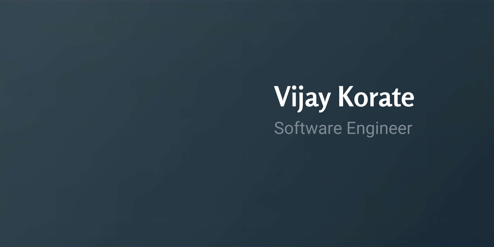

<h1 align="center">Vijay Korate</h1>

  
    Aspiring Web Developer | React.js & API Integration | Clean Code Enthusiast
  

   

  

## 💫 About Me

Hey there! 👋  
I’m a passionate **Frontend Web Developer** focused on building **modern, scalable, and user-friendly web applications** using **React.js** and **Next.js**.  

I believe in **clean code, strong fundamentals, and real-world projects**.

---

## 🚀 What I Do

🌐 **Frontend & React Specialist**  
Building interactive, responsive, and scalable web interfaces using React.js & Next.js.  

⚡ **State & Auth Management**  
Handling state with Redux / Context API & implementing secure authentication flows.  

🔗 **API Integration Expert**  
Connecting frontends to REST APIs, managing asynchronous workflows, and ensuring smooth data flow.  

🎨 **UI/UX Enthusiast**  
Designing clean, accessible, and user-friendly interfaces with modern design principles.  

📝 **Content & Learning Advocate**  
Sharing knowledge through tutorials, blogging about frontend practices, and contributing to open-source projects.

---

## 🔗 Quick Links

  
  
  
  
  

---

---

## 📂 Featured Projects

- **Eat-N-Split:** Split bills among friends using React.js  
- **CRUD App:** Full-stack project with REST API integration  
- **WorldWise:** Travel tracking app with React.js  
- **Travel List:** Manage packing lists with React.js  
- **React Practice Projects:** Component-based exercises to master React  

---

## ⚡ Tech Stack

**Frontend Development:** React.js, Next.js, Redux, JavaScript (ES6+), HTML5, CSS3, Bootstrap  
**Authentication & State Management:** NextAuth.js, Context API, Redux  
**Backend & APIs:** Node.js, RESTful APIs, Postman  
**Version Control & Collaboration:** Git, GitHub  
**Development Tools:** VS Code, npm, Webpack, Chrome DevTools  
**UI/UX Principles:** Responsive Design, Cross-Browser Compatibility, Accessibility  

---

## 🤝 Connect With Me

  <a href="https://www.linkedin.com/in/vijay-korate-a40195231/" target="_blank">LinkedIn</a> • 
  <a href="https://github.com/vijaykorate" target="_blank">GitHub</a> • 
  <a href="mailto:vijaykorate18@gmail.com">Email</a>

